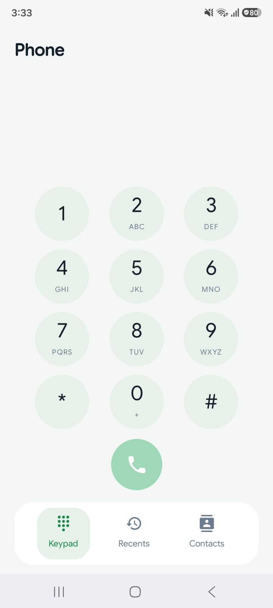
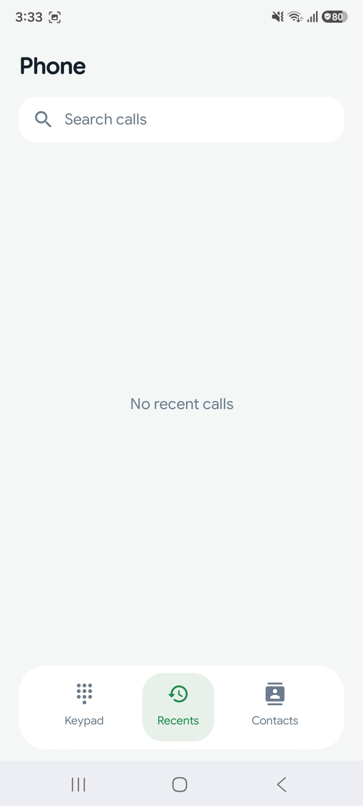
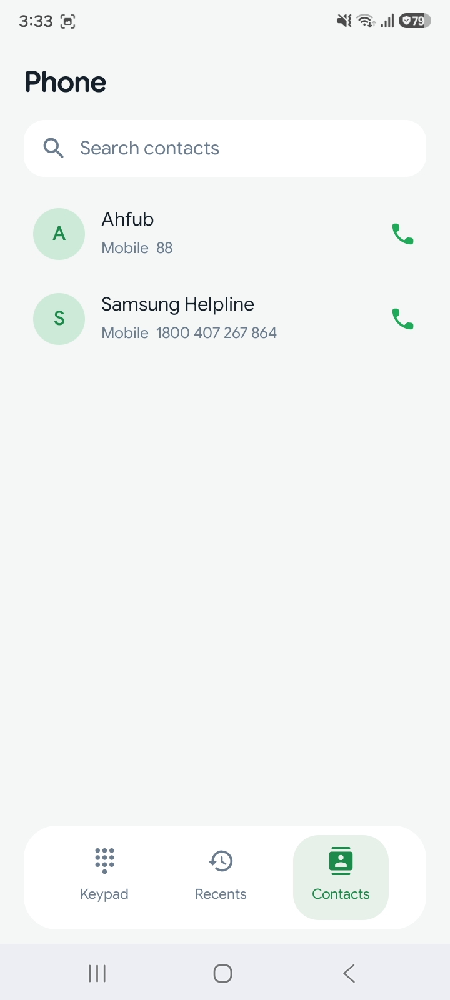

# Phone

A clean and modern Android calling app built with Kotlin and Jetpack Compose.

Phone provides the core calling experience in a simple, responsive interface, including dialing, recent calls, contacts, and call actions.

## Features

- Dial phone numbers using a modern keypad
- Make and receive phone calls
- View recent calls
- Browse and search contacts
- Quickly call contacts from the contact list
- Search recent calls and contacts
- Support for essential in-call actions
- Clean and responsive UI
- Simple navigation between Keypad, Recents, and Contacts

## Tech Stack

- Kotlin
- Jetpack Compose
- Material 3
- Android

## Development

I designed and developed the application with a focus on a smooth calling experience, clean UI, and responsive layouts.

The app was developed on **21 August 2026** as part of my Android development work.

## Screenshots

  
  
  

## Source Code Availability

This is a client project, so the source code is not publicly available.

The screenshots are shared to demonstrate the application, UI implementation, and Android development work.

## Developer

**Aman Sharma**

Android Developer | Kotlin | Jetpack Compose

[LinkedIn](https://www.linkedin.com/in/engineer-aman-sharma)